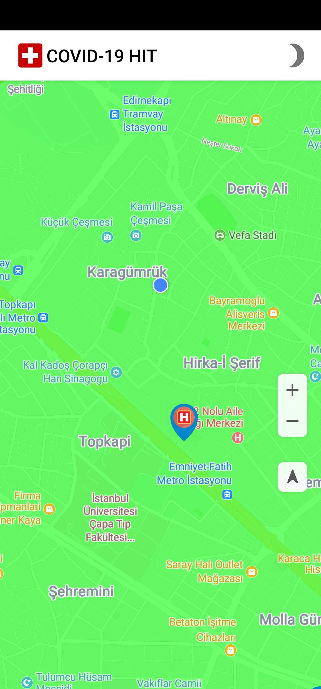
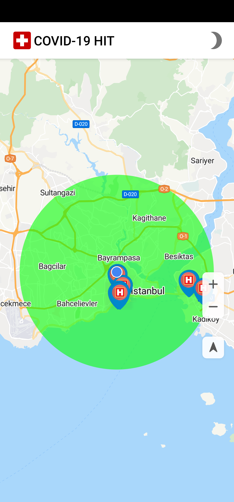
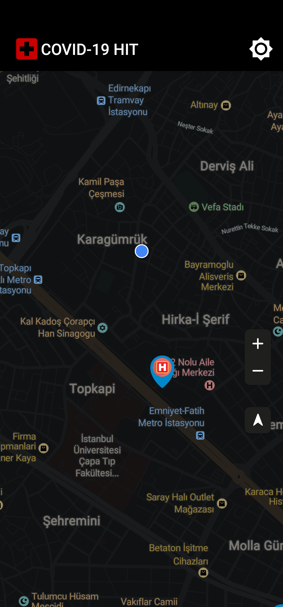
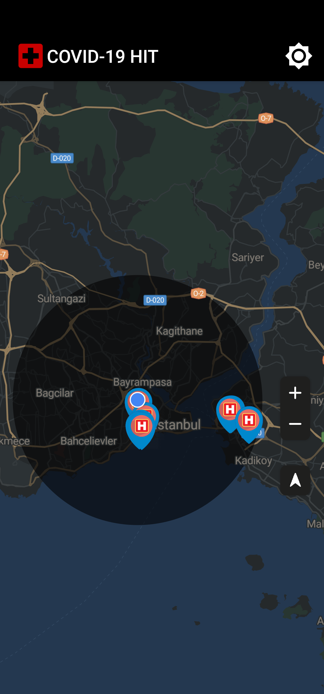

# COVID-19 Health Institution Tracker App

    

<table>
  <tr>
    <th colspan="3">Light Theme</th>
  </tr>
  <tr>
    <td>SplashActivity</td>
     <td colspan="2">HomeActivity</td>
  </tr>
  <tr>
    <td></td>
    <td></td>
    <td></td>
  </tr>
 </table>

 <table>
  <tr>
    <th colspan="3">Dark Theme</th>
  </tr>
  <tr>
    <td>SplashActivity</td>
     <td colspan="2">HomeActivity</td>
  </tr>
  <tr>
    <td></td>
    <td></td>
    <td></td>
  </tr>
 </table>

It's an Android sample application that uses **Huawei Mobile Services (HMS)** to display and search health institutions around you that supports Coronavirus testing in Turkey. The default search radius is 10 km. 

The project aims to how to use **HMS** in the real-life applications. Our use-case is displaying all the near health institutions around you that have certificate to test for Coronavirus. The list itself declared in the website of Ministry of Health of Turkey. You can check the list out at the link below.

[The official list of health institutions](https://covid19bilgi.saglik.gov.tr/tr/covid-19-yetkilendirilmis-tani-laboratuvarlari-listesi)

We're going to use `Analytics` + `Map` + `Location` + `Site` Kits and `Directions` API to demonstrate theirs usage in this use-case. Application's architecture pattern is `MVVM` with modular project architecture. Currently, project have 3 modules which are `App`, `Base` and `Network` modules. Their usage and role differs as module. And lastly, it developed with everyone's favorite Kotlin Coroutine which is the language level supported feature.

> ⚠ Please for inspection, install the APK in \resources folder. Installing Android Studio would cause you problems. The first problem would be the missing keystore (.jks) file. Even though, you create one. You need to create a project on AppGallery Connect and remake the initial setup process. That would take some time. That's why I suggest you install APK before getting into some labor.

## Features

Application has couple of features such as;

> ⚠ **Warning: The only checked ones are meant to be finished. Other than that means, they're still in progress.**  

- [x]  Provides visual to discover what is around you via Map Kit
- [x]  Locates user's current location via Location Kit
- [x]  Shows nearby health institutions around 10 KM via Site Kit
- [x]  Sends user events or properties via Analytics Kit
- [x]  Gets directions based on the options that you select which are by walk, by a drive, and by bike options via Directions API
- [x]  Starts navigation view based on direction data